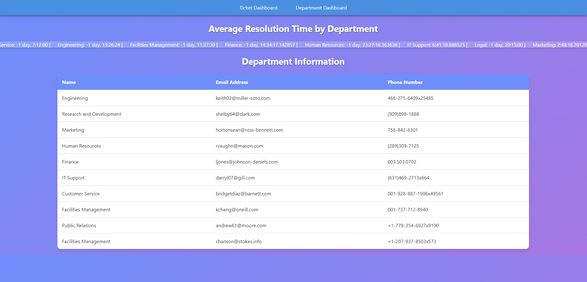
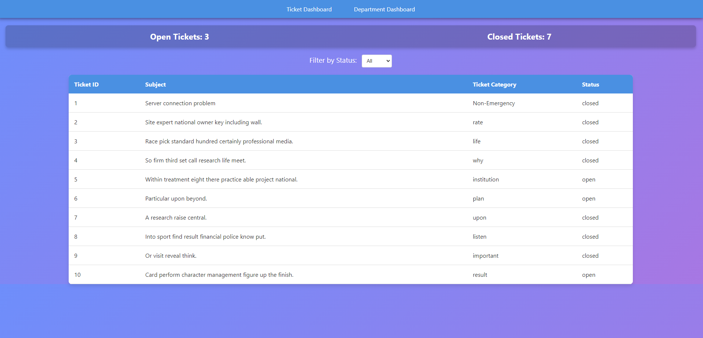

# IT-web

## Overview
This project is closely integrated with the IT-Ticketing system API, which can be found in a separate repository [here](https://github.com/molin6/IT-Ticketing/tree/main/Group%201%20Ticketing%20System%20API).

## Features
The application includes several key features:

- **Department Management:** Allows users to view and manage IT departments.
- **Ticket Tracking:** Integrated with the IT-Ticketing system for efficient tracking of IT issues and requests.

## Screenshots
Here are some screenshots of the application:


*Departments Interface*


*Ticket Tracking Interface*

## How to Run
To run IT-web, follow these steps:

1. Clone the repository:
   ```
   git clone https://github.com/molin6/IT-web.git
   ```
2. Install the required dependencies:
   ```
   pip install -r requirements.txt
   ```
3. Run the application:
   ```
   python manage.py runserver
   ```

## API Integration
This project works in conjunction with the IT-Ticketing API, which is hosted in a separate repository. For more details on the API, visit the [IT-Ticketing Repository](https://github.com/molin6/IT-Ticketing).

---

